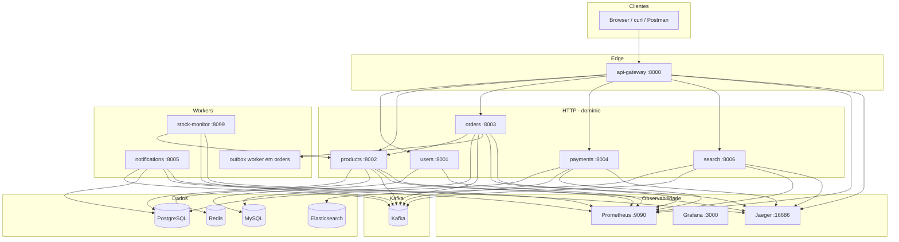
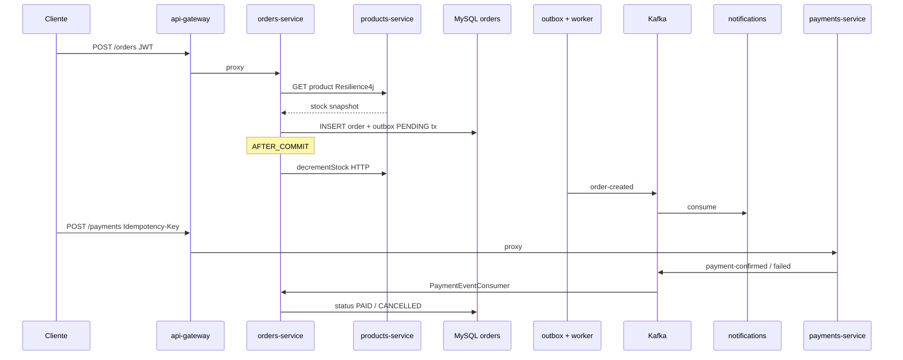

# MeliSim — Arquitetura detalhada

Este documento complementa o [README.md](README.md) (visão geral e quickstart) e o [STUDY_GUIDE.md](STUDY_GUIDE.md) (padrões e roteiro de entrevista). Aqui o foco é **como as peças se conectam**: tráfego, dados, eventos, observabilidade e limites de segurança.

---

## 1. Visão em camadas

| Camada | Componentes | Responsabilidade |
|--------|-------------|------------------|
| **Edge** | `api-gateway` | JWT na borda, rate limit (Redis ou memória), proxy HTTP, `X-Request-ID`, métricas HTTP |
| **Domínio síncrono** | `users-service`, `products-service`, `orders-service`, `payments-service`, `search-service` | Regras de negócio expostas via REST |
| **Domínio assíncrono** | Kafka + consumidores (`orders-service`, `notifications-service`, `search-service`) | Eventos, desacoplamento temporal |
| **Workers** | `stock-monitor`, `OutboxPublisherWorker` (Kotlin), consumers Python | Tarefas periódicas ou drain de outbox |
| **Dados** | MySQL, PostgreSQL, Redis, Elasticsearch | Persistência e caches por bounded context |
| **Observabilidade** | Prometheus, Grafana, Jaeger | Métricas, dashboards, traces OTLP |

Não existe service mesh: tráfego interno na rede Docker confia na topologia compose (adequado a lab; em produção usar TLS/mTLS ou rede privada endurecida).

---

## 2. Diagrama de contexto (C4 simplificado)

---

## 3. Fluxo de pedido e pagamento (resumo)

Pontos importantes:

- O evento Kafka `order-created` **não** é publicado dentro da mesma thread síncrona da API; sai do **outbox** após commit.
- O **decremento de estoque** em `products-service` corre **depois do commit** do pedido (`OrderSideEffects`), para não segurar conexão JDBC durante HTTP.
- Pagamentos publicam `payment-confirmed` ou `payment-failed`; `orders-service` atualiza estado da máquina de estados.

---

## 4. Mapa de dados (quem escreve onde)

| Armazenamento | Serviços | Conteúdo típico |
|---------------|----------|------------------|
| **MySQL** | `users-service`, `orders-service` | Utilizadores, pedidos, **outbox_events** |
| **PostgreSQL** | `products-service`, `payments-service`, `notifications-service` | Catálogo, pagamentos, idempotência, histórico de notificações |
| **Redis** | `products-service`, `api-gateway` | Cache de listagem de produtos; rate limit por IP (sorted set + Lua) |
| **Elasticsearch** | `search-service` | Índice de busca derivado de eventos |
| **Kafka** | Vários produtores/consumidores | Ver secção 5 |

---

## 5. Kafka — tópicos e responsabilidades

| Tópico | Produtor(es) | Consumidor(es) | Notas |
|--------|--------------|----------------|-------|
| `order-created` | orders (via outbox worker) | notifications | Payload com dados do pedido |
| `payment-confirmed`, `payment-failed` | payments | orders, notifications | Atualiza estado + recibo simulado |
| `stock-updates`, `product-created` | products | search | CQRS leve do catálogo |
| `stock-alert` | stock-monitor | notifications | E-mail simulado ao vendedor |
| `*.dlq` | notifications, search (em falha) | — | Triagem manual; criados em `infra/kafka/topics.sh` |

Sem Schema Registry: payloads JSON por convenção entre serviços.

---

## 6. api-gateway — pilha de middleware e segurança

Ordem de execução no **request** (último `add_middleware` no FastAPI/Starlette = mais externo):

1. **CorrelationIdMiddleware** — gera ou honra `X-Request-ID`, disponibiliza para logs.
2. **AuthMiddleware** — JWT HS256 exceto `PUBLIC_PATHS` (`/health`, `/health/live`, `/health/ready`, `/docs`, login, register, GET de produtos, etc.).
3. **RedisRateLimiterMiddleware** ou **RateLimiterMiddleware** — conforme `REDIS_URL`.
4. **PrometheusMiddleware** — latência e contadores HTTP.
5. **CORSMiddleware** — origens abertas no lab (`setup_cors` no início do `main.py`; na pilha fica mais próximo da aplicação).

**Métricas protegidas:** `GET /metrics` aceita um **Bearer dedicado ao scrape** (não é JWT de utilizador). O token vem de `METRICS_SCRAPE_TOKEN_FILE` (ficheiro montado no container) ou `METRICS_SCRAPE_TOKEN`. O Prometheus usa `authorization.credentials_file` apontando para o **mesmo** ficheiro secreto (`infra/prometheus/secrets/gateway-metrics.token`), alinhado à boa prática de não expor métricas sem credencial mesmo na rede interna.

---

## 7. Observabilidade

| Sinal | Onde | Como |
|-------|------|------|
| **Métricas** | `/metrics` (Python/Go) ou `/actuator/prometheus` (Spring) | Prometheus scrape 15s; job `api-gateway` com Bearer |
| **Traces** | OTLP HTTP → Jaeger `:4318` | OpenTelemetry nos serviços Python; Micrometer OTel nos JVM/Go onde configurado |
| **Logs** | stdout JSON | `request_id` / correlation nos middlewares |

Grafana: datasource Prometheus + dashboard provisionado *MeliSim overview*.

---

## 8. CI (alto nível)

GitHub Actions (`.github/workflows/ci.yml`): jobs por linguagem (Ruff + pytest + cobertura em Python; Maven em users; Gradle wrapper em orders; Go test com race), validação `docker compose config`, **Trivy** filesystem e config com **`exit-code: "0"`** (modo **advisory** — relatório sem bloquear o merge no baseline atual).

---

## 9. Limitações conscientes (lab)

- Segredos e passwords em `docker-compose.yml` e ficheiro de métricas são **para desenvolvimento**.
- E-mail e push em `notifications-service` são **simulados** (log + `print`).
- Elasticsearch sem segurança XPack no compose de demo.
- Sem Testcontainers na CI; smoke opcional via `test.sh` com stack no ar.

Para evolução: ver secção *What's deliberately NOT here* no README.

---

## 10. Onde aprofundar

| Tema | Documento |
|------|-------------|
| Padrões e perguntas de entrevista | [STUDY_GUIDE.md](STUDY_GUIDE.md) |
| Comandos, portas, walkthrough de compra | [README.md](README.md) |
| Tópicos Kafka e DLQ | `infra/kafka/topics.sh` |
| Scrape Prometheus | `infra/prometheus/prometheus.yml` + `infra/prometheus/secrets/README.txt` |
